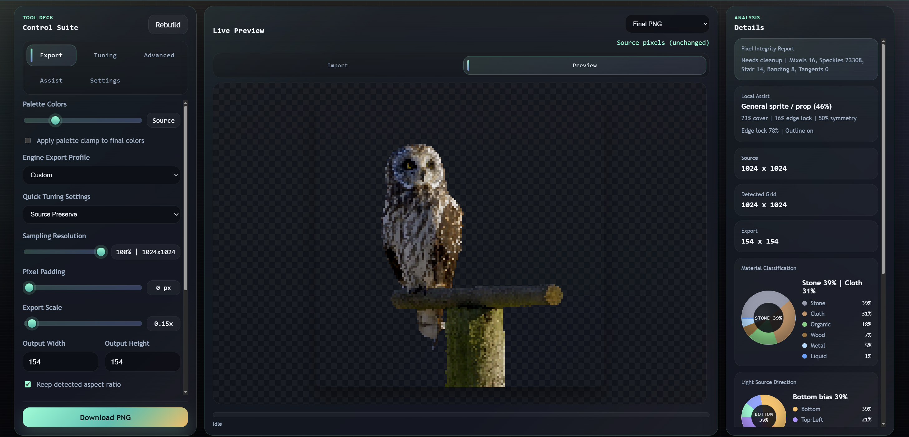
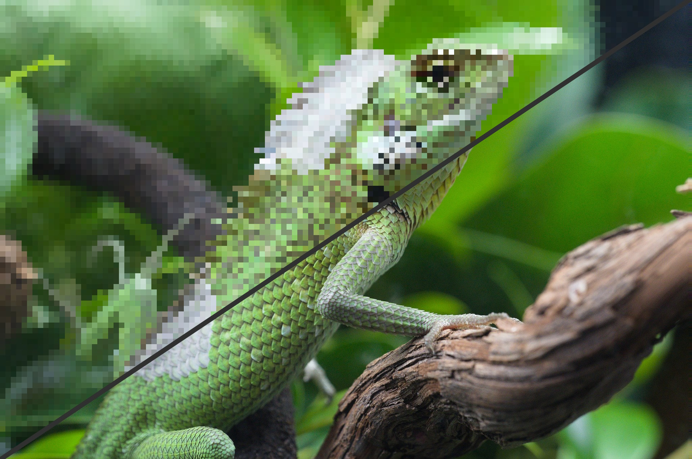

# Pixel Snapper

## [Live Here! https://pixelsnapper.tabularisgames.com/](https://pixelsnapper.tabularisgames.com/)

An advanced pixel art resampling, snapping, and optimization tool built
for serious production workflows. 

Built in a day. 
Will continue to be updated during Cogheart's production.

Pixel Snapper is a browser-based pixel processing suite originally
developed for **Cogheart**, a large-scale online sandbox MMO. It goes
far beyond basic resizing, it performs structural grid detection,
palette analysis, pixel snapping, cleanup passes, and export preparation
tailored for game engines and shader pipelines.

Fully open source. Fully client-side. No uploads. No tracking.

------------------------------------------------------------------------

## Why This Exists

Most online "pixel resizers" just scale images.

Pixel Snapper analyzes the image structure, detects pixel grids,
stabilizes cuts across both axes, resamples by dominant color regions,
and performs targeted post-processing passes to clean artifacts.

It was built because existing web tools were insufficient for
production-grade asset pipelines.

------------------------------------------------------------------------

## Core Capabilities

### Intelligent Grid Detection & Snap

-   Column/row profile analysis
-   Adaptive step estimation
-   Grid stabilization across axes
-   Dominant-color region resampling
-   Optional bypass mode for raw editing

------------------------------------------------------------------------

### Palette & Quantization Control

-   2-256 color quantization
-   Adaptive palette budgeting
-   Palette clamp control
-   Ordered dithering
-   Palette balance weighting
-   Indexed export modes

------------------------------------------------------------------------

### Advanced Cleanup Passes

-   Sharpen pre-pass
-   Despeckle passes
-   Mixel cleanup + guard thresholds
-   Edge locking
-   Anti-alias intent control
-   Gradient ramp shaping
-   Dither zoning

------------------------------------------------------------------------

### Semantic & Assist Systems

-   Subject-aware tuning
-   Smart tuning presets
-   Style presets for common production targets
-   Material-aware analysis
-   Light sector breakdown

------------------------------------------------------------------------

### Export Profiles

Engine-ready presets including: - Unity URP 2D - Unreal Paper2D -
Indexed WebGL - LUT shader pipelines - Retro handheld constraints -
Print / atlas preparation

Export extras: - Metadata JSON - Palette LUT - Material maps - Normal
maps - AO maps

------------------------------------------------------------------------

### Off-Main-Thread Processing

Heavy image processing runs in a dedicated worker.

This allows: - Large image handling - Progressive progress updates -
OffscreenCanvas rasterization - Transferable buffer messaging -
Responsive UI during processing

------------------------------------------------------------------------

## Architecture Overview

-   `index.html` -- UI shell
-   `styles.css` -- Themed UI styling
-   `main.js` -- App orchestration, state, persistence, UI binding
-   `pixel-snapper.js` -- Core snapping + quantization engine
-   `processing-worker.js` -- Worker execution layer

All processing is performed client-side using ImageData buffers and
transferables.

No external dependencies.

------------------------------------------------------------------------

## Design Goals

-   Production-ready output
-   Deterministic results
-   Engine-aware exports
-   Non-destructive pipeline
-   High control surface
-   Zero server cost
-   Fully offline capable

------------------------------------------------------------------------

## Use Cases

-   Cleaning AI-generated sprites
-   Converting painted art to grid-stable pixel art
-   Preparing sprite sheets for Unity or Unreal
-   Generating indexed textures for shader workflows
-   Enforcing strict palette constraints
-   Repairing soft gradients into controlled ramps
-   MMO asset pipeline preprocessing

------------------------------------------------------------------------

## Performance Notes

-   Worker-based processing prevents UI blocking
-   Transferable buffers reduce memory copying
-   Max export dimension: 8192
-   Adaptive sampling caps large source images to maintain
    responsiveness

------------------------------------------------------------------------

## License

MIT License\
Copyright (c) 2025 Justice Shultz
